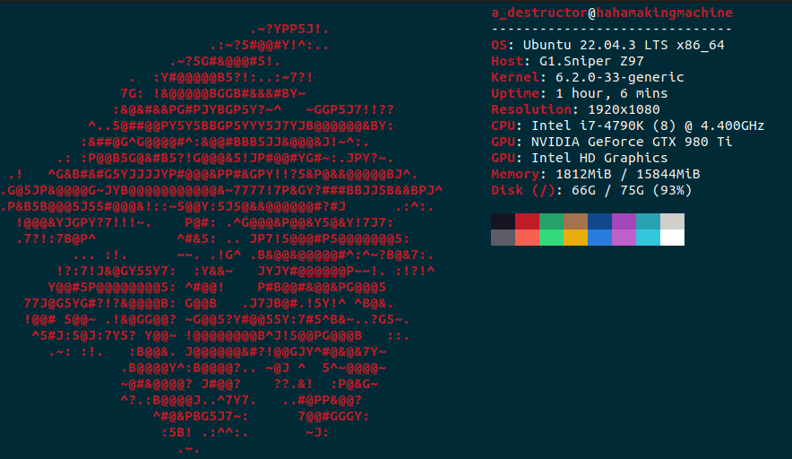
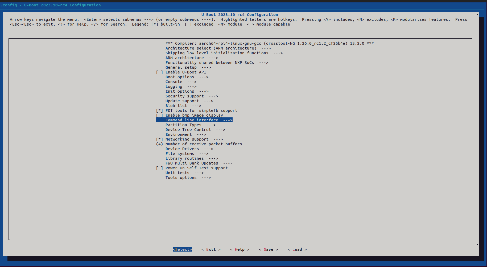

# Our-Boot_U-Boot_bootloader_for_RPi4

This is a U-Boot-based bootloader for Raspberry Pi 4. This README file will walk you through the process as I experienced it.

Notes:
  1. This bootloader was built on 10/9/2023. Some steps may differ/be omitted altogether. Please, bare in mind that U-Boot is a piece of software that gets updated constantly and your steps may vary depending on when you decide to build/use it.
  2. This bootloader was built on an Ubuntu 22.04 system on my trusty ten-year-old PC with the following specs:
       1. i7 4790k @4.4GHz
       1. 16GB DDR3 RAM @2400MHz
       1. GTX 980ti (irrelevant to this project) \
This piece of info is a bit irrelevant for this project since the built was done under a minute.
       1. A Kingston HyperX Savage SSD.
       
       
        
  3. The bootloader was built for Raspberry Pi 4 using a custom cross-toolchain I created in an earlier project. Feel free to visit it for more detail: [Crosstool-NG_RPi4](https://github.com/AhmedAlyEl-Ghannam/Crosstool-NG_RPi4)
  4. The source I followed is Chris Simmond's book "Mastering Embedded Linux Programming - Second Edition" chapter 3: All about Bootloaders. It is a fantastic book that I STRONGLY recommend. But, bear in mind that the instructions listed in the chapter are for Beaglebone Black. If you use any other single board computer, you are on your own. If you decide to use Raspberry Pi 4, you came to the right place comrade.


## Building Our-Boot

1. Clone the U-Boot repository. Make sure to clone it where you want to use it.
   
   ```
   git clone git@github.com:u-boot/u-boot.git
   ```

   
2. Open the cloned repository folder and make sure you are operating on the latest branch. `u-boot-2023.07.y` is the latest branch as of the time of writing this README file.

   ```
   cd u-boot
   git checkout u-boot-2023.07.y
   ```

3. For Raspberry Pi 4, I want to build a 64-bit system. So, I will choose the configuration file named `rpi_arm64_defconfig`. It already supports the device tree binary of RPi4's chipset (BCM2711). Make sure to set both the architecture as `arm` and the cross compiler as `aarch64-rpi4-linux-gnu-`: the crosstool-NG toolchain I created in my previous project. Make sure to add it to `PATH` to proceed.

   ```
   PATH=${HOME}/x-tools/aarch64-rpi4-linux-gnu/bin/:$PATH
   make rpi_4_defconfig ARCH=arm CROSS_COMPILE=aarch64-rpi4-linux-gnu-
   ```

4. You can access U-Boot's `menuconfig` before building your bootloader to adjust settings on a deeper level. I left it as it is but changed the bootloader's command prompt to "Our-Boot" just for the memes.

   ```
   make menuconfig ARCH=arm CROSS_COMPILE=aarch64-rpi4-linux-gnu-
   ```
   
   
   

5. Now, the build process is ready. Simply run the following command:

   ```
   make ARCH=arm CROSS_COMPILE=aarch64-rpi4-linux-gnu-
   ```


The process took less than a minute. It generated the following files:

  

Keep in mind that the generated files differ from on board configuration to another. For example, a U-Boot generated for Beaglebone Black produces a file named MLO that is unique for TI's hardware.


## Installing Our-Boot

The only file that concerns us is `u-boot.bin`. Simply copy this file to "boot" partition in your sd card.

  ```
  cp u-boot.bin /media/boot
  ```

### Note
Keep in mind that the bootloader generated here cannot be tested alone. Multiple boot files are needed and will be generated in the next project: [Linux_Kernel_Built_For_RPi4](https://github.com/AhmedAlyEl-Ghannam/Linux_Kernel_Built_For_RPi4). Feel free to visit it for more info. I will add a detailed readme file to it once it is fully complete.
   

   

   
   
